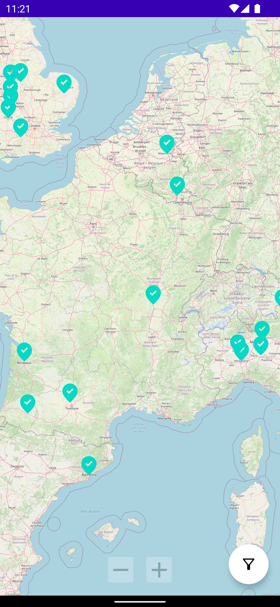
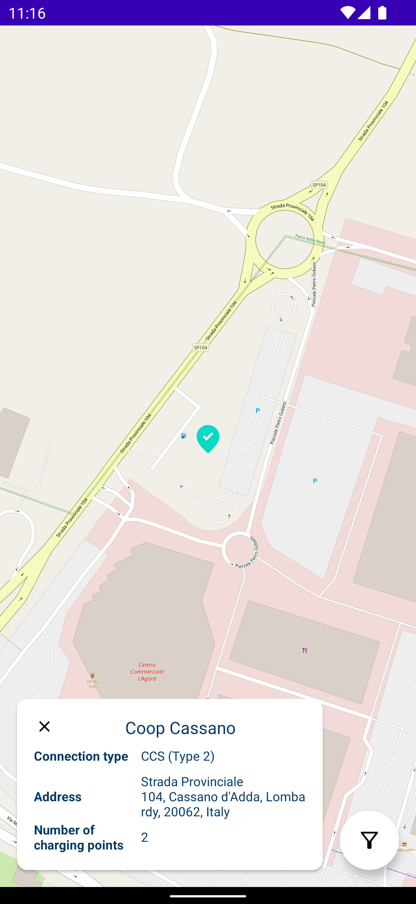
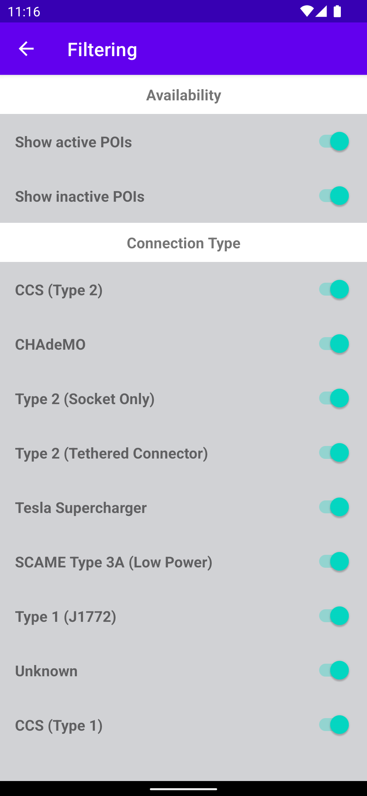

## Implementation
App architecture is MVVM, single Activity with using fragments as screens.
Used Technologies: Kotlin, Coroutines, LiveData, Hilt, Retrofit, okhttp, Gson, Jetpack navigation, View binding, Open Street Map.

### Screens
App contains 2 screens:
* Home Screen with map, details view and FAB which can be used for opening Filtering Screen.

* Filtering Screen which contains a list of available filters with 2 sections: Availability and Connection Type which are based on data from remote feed.

